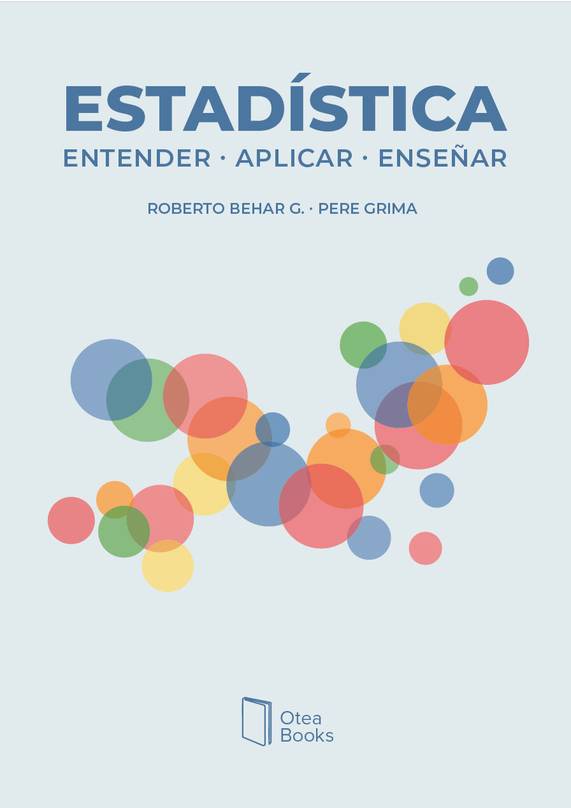

::: {text-align="center"}
**OteaBooks** es el sello con el que publicamos nuestros libros en Amazon. Hemos cuidado todos los detalles de la edición para que el contenido se presente con claridad y sea fácil de seguir. Creemos que el contenido importa, pero también la forma en que se presenta.

Además, todos los libros pueden consultarse gratuitamente en línea, en cualquier momento y desde cualquier lugar.

:::

::: grid
::: {.g-col-12 .g-col-md-4 text-align="center"}

{width=80%}

*Respuesta detallada a las preguntas que suelen surgir en los cursos introductorios de estadística, o en discusiones sobre las posibilidades y relevancia de esta disciplina.*

[Enlace al libro](https://peregrima.github.io/Estadistica_FAQ/){.btn .btn-outline-primary .btn-sm}

Comprar en: [Amazon.com](https://a.co/d/07REvkXh){.btn .btn-outline-primary .btn-sm} [Amazon.es](https://amzn.eu/d/09JVSKhU){.btn .btn-outline-primary .btn-sm}
:::

::: {.g-col-12 .g-col-md-4 text-align="center"}

{width=80%}

*Contenido habitual en cursos introductorios. Lenguaje cercano y especial atención a los conceptos y las aplicaciones. Las matemáticas son una actor del reparto, no el protagonista.*

[Enlace al libro](https://peregrima.github.io/Estadistica_Entender/){.btn .btn-outline-primary .btn-sm}

Comprar en: [Amazon.com](https://a.co/d/099mmgNH){.btn .btn-outline-primary .btn-sm} [Amazon.es](https://amzn.eu/d/001hh26f){.btn .btn-outline-primary .btn-sm}
:::

::: {.g-col-12 .g-col-md-4 text-align="center"}
### Libro 3

en camino...
<!-- [Enlace al libro]{.btn .btn-outline-primary .btn-sm} -->
:::
:::

::: {.callout-note appearance="simple" icon="false"}
## ✉️ Contacto

Si tienes alguna pregunta o sugerencia, o detectas algún error, puedes escribirnos a [OteaBooks](mailto:soporte@tuweb.com).
:::
